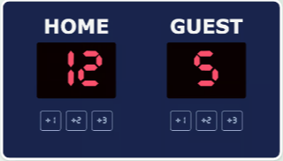

# Project requirements;
    build from "scratch"
    make all six buttons work 
    follow the design -> 

    
    ## Stretch goals;
    add a "new game" button
    highlight the leader
    add a few more counters like period, fouls, timer
    change the design

   
